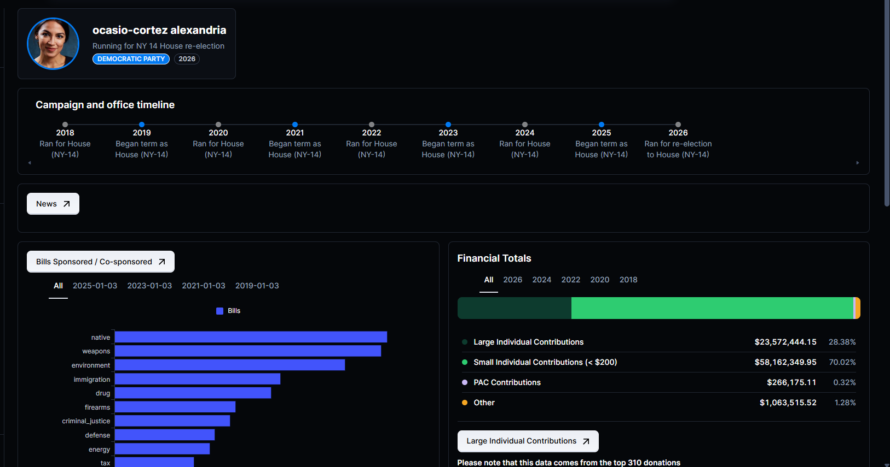
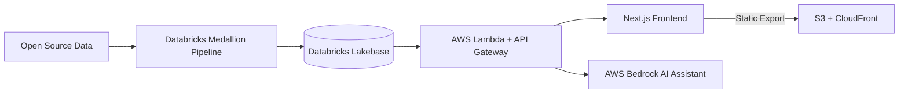

# 🗳️ The Lazy Voter

### Congressional civic data for the masses

The Lazy Voter aggregates open-source civic data and turns it into easy-to-follow dashboards on candidates running for Congress — so you can get informed before digging deeper yourself.

---

## ✨ Features

| | |
|---|---|
| 💰 **Finances** | Breakdown of candidate campaign finances by cycle and donor |
| 🔍 **Candidate Search** | Find candidates running for office by state, party, and role |
| 📜 **Legislation** | Browse bills sponsored or co-sponsored by incumbents |
| 📰 **News** | Track recent news coverage on candidates |
| 🏛️ **Bill Tracker** | See what's currently moving through Congress |
| 🤖 **AI Assistant** | Chat with an AI assistant to ask questions and learn more about any candidate |

---

## 🧰 Tech Stack

| Layer | Technologies |
|---|---|
| 🎨 **Frontend** | Next.js, TypeScript, React, Material UI |
| 📊 **Data Aggregation** | Python, PySpark, Databricks (medallion ETL pipelines) |
| ⚙️ **Backend / Infra** | AWS Lambda, API Gateway, S3, CloudFront, Databricks Lakebase (Postgres), Terraform |
| 🧠 **AI** | AWS Bedrock |

---

## 🏗️ Architecture

Data is ingested from sources like the FEC and LegiScan through a Databricks medallion pipeline (bronze → silver → gold), with entity resolution across sources handled via embedding-based clustering. Cleaned data lands in Databricks Lakebase, which Lambda functions query through API Gateway. The frontend is a statically exported Next.js app served from S3 via CloudFront, with infrastructure managed through Terraform and deployed via GitHub Actions.